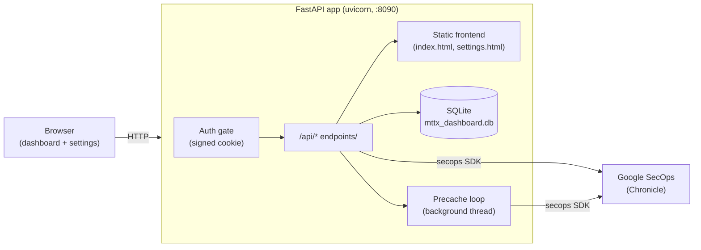

# MTTX Dashboard

A self-contained web dashboard for **MTTD / MTTA / MTTR** case metrics from
**Google SecOps (Chronicle)**. Point it at one or more Chronicle tenants and it
shows how fast alerts are being detected, acknowledged and resolved — with
per-day trends, rule/severity breakdowns, a filterable case list, CSV export and PDF export.

Everything is configured from the app itself (service account, tenants, case
filters, branding, login password). No config files to edit, no environment
variables required. Drop it on a server, open it, fill in Settings, share the URL.


> Not affiliated with or endorsed by Google. "Chronicle" and "Google SecOps" are trademarks of Google LLC.

---

## Table of contents

- [Features](#features)
- [Screenshots](#screenshots)
- [Architecture](#architecture)
- [Requirements](#requirements)
- [Quick start](#quick-start)
- [Configuration (all in-app)](#configuration-all-in-app)
- [Environment variables](#environment-variables-optional)
- [Metrics explained](#metrics-explained)
- [API reference](#api-reference)
- [Data & storage](#data--storage)
- [Deployment (systemd + nginx)](#deployment-systemd--nginx)
- [Security notes](#security-notes)
- [Project structure](#project-structure)
- [Contributing](#contributing)
- [License](#license)

---

## Features

- **MTTX metrics** — Mean Time to Detect (MTTD), Acknowledge (MTTA) and Respond (MTTR),
  computed from Chronicle case history.
- **Trends & breakdowns** — daily MTTR average, resolution-time distribution, and
  breakdowns by rule and severity.
- **Case list** — searchable, sortable, filterable table with one-click open in SecOps.
- **Export** — download the visible cases as CSV, or the whole dashboard as PDF.
- **Multi-tenant** — register any number of Chronicle instances and switch between them.
- **Configurable case filters** — exclude noisy/internal cases by keyword; stored in the
  DB and managed from Settings (never hard-coded). Ships empty.
- **Service account from Settings** — upload your Google SecOps key in the UI; it is stored
  server-side and the private key is never displayed back.
- **Single-password login** — optional gate for the whole app, set/disabled from Settings
  (password stored hashed, signed HttpOnly session cookie). Ships open.
- **Branding** — optional top-bar logo, set from Settings. No logo baked in.
- **Fast** — server-side cache + background precache (last 3 months + rolling 7-day window),
  and open tabs silently auto-refresh every ~4 minutes.

## Screenshots

> Add your own screenshots to a `docs/` folder and reference them here, e.g.:
>
> ```markdown
> 
> 
> ```

## Architecture

A single FastAPI process serves both the JSON API and the static frontend, talks to
Chronicle via the official `secops` SDK, and persists everything to a local SQLite file.



- **Backend:** FastAPI + SQLAlchemy, served by uvicorn. Single file: `backend/main.py`.
- **Frontend:** dependency-free HTML/CSS/JS (`frontend/index.html`, `frontend/settings.html`),
  served by the same app at `/`. The API is same-origin at `/api`.
- **Storage:** SQLite (`backend/mttx_dashboard.db`), created automatically on first run.
- **Auth:** an HTTP middleware enforces a signed-cookie gate when a password is configured.

## Requirements

- **Python 3.10+**
- A **Google SecOps (Chronicle) service-account** JSON key with permission to read case
  and detection data, plus each tenant's **Customer ID (GUID)**, **region** and **GCP project ID**.
- Outbound network access from the server to Google SecOps APIs.

## Quick start

```bash
git clone https://github.com/<you>/mttx-dashboard.git
cd mttx-dashboard

# install backend dependencies
pip install -r backend/requirements.txt

# run (serves API + UI on http://localhost:8090)
sh start.sh
```

Then open <http://localhost:8090> and finish setup in **⚙ Settings** (see below).

- Custom port: `PORT=9000 sh start.sh`
- Behind HTTPS: `MTTX_SECURE=1 sh start.sh`
- Air-gapped install: pre-download the wheels for `backend/requirements.txt` with
  `pip download -r backend/requirements.txt -d wheels`, then
  `pip install --no-index --find-links=wheels -r backend/requirements.txt`.

## Configuration (all in-app)

Open **⚙ Settings** and work top-down:

1. **Google SecOps Credentials** — paste or upload your service-account `.json` key.
   Stored at `backend/sa.json` (git-ignored); the private key is never shown back.
2. **Chronicle Connections** — add a tenant: **Name**, **Customer ID / GUID**, **Region**
   (e.g. `europe`, `us`), **GCP Project ID**.
3. **Access / Login** — set a password to lock the dashboard (optional; ships open).
   Changing it signs existing sessions out. You'll be redirected to sign in afterwards.
4. **Case Filters** *(optional)* — add keywords to exclude matching cases from the metrics.
5. **Branding** *(optional)* — upload a logo or paste an image URL for the top bar.

Then go back to the dashboard, pick a **tenant** and a **period**, and analyze.

## Environment variables (optional)

Nothing here is required — see [`.env.example`](.env.example). Use them only to override defaults.

| Variable          | Default | Purpose |
|-------------------|---------|---------|
| `PORT`            | `8090`  | HTTP port to serve on. |
| `MTTX_SECURE`     | `0`     | Set to `1` behind HTTPS so the session cookie is marked `Secure`. |
| `MTTX_TTL_HOURS`  | `12`    | Login session lifetime, in hours. |
| `MTTX_PASSWORD`   | *(unset)* | If set, **pins** the login password and disables the in-app password controls. |
| `MTTX_SECRET`     | *(unset)* | Fixed cookie-signing secret. If unset, one is generated/derived and persisted. |
| `MTTX_DB`         | `backend/mttx_dashboard.db` | Path to the SQLite database. Use it to place the DB in a writable location. |
| `GOOGLE_APPLICATION_CREDENTIALS` | auto | Set automatically to the uploaded `sa.json` when a key is uploaded. |

> The app stores its DB (and the uploaded `sa.json`) in `backend/` by default. If that folder isn't
> writable, it automatically falls back to `~/.mttx-dashboard/` so setup still works — set `MTTX_DB`
> to choose the location explicitly.

## Metrics explained

| Metric | Meaning | Measured from |
|--------|---------|---------------|
| **MTTD** — Mean Time to Detect      | Time from the earliest underlying event to the case/alert being raised. | Detection vs. event timestamps |
| **MTTA** — Mean Time to Acknowledge | Time from case creation to first analyst acknowledgement. | Case open vs. first action |
| **MTTR** — Mean Time to Respond     | Time from case creation to resolution/closure. | Case open vs. close |

Cases matching any configured **Case Filter** keyword (in title, rule name or alert names)
are excluded before metrics are computed.

## API reference

Base path: `/api`. All endpoints require the session cookie when a login password is set
(the `/auth/*` routes and static assets are exempt). Responses are JSON.

### Health & auth

| Method | Path | Description |
|--------|------|-------------|
| `GET`  | `/api/version`            | App/version info. |
| `GET`  | `/api/auth/config`        | `{ enabled, env_locked }` — whether login is on / pinned by env. |
| `PUT`  | `/api/auth/password`      | Set/change the login password `{ "password": "…" }`. |
| `DELETE` | `/api/auth/password`    | Disable login (open mode). |
| `GET`  | `/auth/login`             | Login page (HTML). |
| `POST` | `/auth/login`             | Submit password (form) → sets session cookie. |
| `GET`  | `/auth/logout`            | Clear session cookie. |
| `GET`  | `/auth/verify`            | `200` if the current cookie is valid, else `401`. |

### Credentials & branding

| Method | Path | Description |
|--------|------|-------------|
| `GET`    | `/api/credentials` | Non-secret status of the uploaded service account. |
| `PUT`    | `/api/credentials` | Upload the SA key `{ "content": "<json>" }`. |
| `DELETE` | `/api/credentials` | Remove the stored SA key. |
| `GET`    | `/api/branding`    | Current logo (data URL or https URL). |
| `PUT`    | `/api/branding`    | Set the logo `{ "logo": "…" }`. |
| `DELETE` | `/api/branding`    | Remove the logo. |

### Tenants

| Method | Path | Description |
|--------|------|-------------|
| `GET`    | `/api/tenants`                  | List Chronicle connections. |
| `POST`   | `/api/tenants`                  | Add a tenant `{ name, guid, region, gcp_project_id }`. |
| `PUT`    | `/api/tenants/{tenant_id}`      | Update a tenant. |
| `DELETE` | `/api/tenants/{tenant_id}`      | Remove a tenant. |
| `POST`   | `/api/tenants/{tenant_id}/test` | Test connectivity to the tenant. |

### Case filters

| Method | Path | Description |
|--------|------|-------------|
| `GET`    | `/api/exclusions`            | List filter keywords. |
| `POST`   | `/api/exclusions`            | Add a keyword `{ keyword, note? }`. |
| `DELETE` | `/api/exclusions/{exc_id}`   | Remove a keyword. |

### MTTX

| Method | Path | Description |
|--------|------|-------------|
| `POST` | `/api/mttx/run`                          | Run analysis for a tenant/period (live query). |
| `GET`  | `/api/mttx/cached/{tenant_id}`           | Cached result for a date range (`?start_date=&end_date=`). |
| `GET`  | `/api/mttx/latest/{tenant_id}`           | Most recent cached run. |
| `GET`  | `/api/mttx/history`                      | List past runs. |
| `GET`  | `/api/mttx/history/{run_id}`             | A specific past run. |
| `GET`  | `/api/mttx/log-types/{tenant_id}`        | Ingested log types / volume. |
| `GET`  | `/api/mttx/alert-count/{tenant_id}`      | Alert count for the period. |
| `GET`  | `/api/mttx/cache/clear-months`           | Clear cached monthly runs. |
| `GET`  | `/api/mttx/debug/pb-raw/{tenant_id}`     | Debug: raw case data. |
| `GET`  | `/api/mttx/debug/pb-comments/{tenant_id}`| Debug: case comments. |

Interactive docs are available at `/docs` (Swagger UI) when the app is running.

## Data & storage

Everything lives in the app folder — back these up:

- `backend/mttx_dashboard.db` — SQLite database (tenants, cached runs, case filters,
  branding, and the hashed login password).
- `backend/sa.json` — the uploaded Google SecOps service-account key. **Sensitive**;
  git-ignored by default. Never commit it.

Both are created at runtime and are excluded by [`.gitignore`](.gitignore).

## Deployment (systemd + nginx)

**systemd unit** — `/etc/systemd/system/mttx-dashboard.service`:

```ini
[Unit]
Description=MTTX Dashboard
After=network.target

[Service]
WorkingDirectory=/opt/mttx-dashboard/backend
ExecStart=/usr/bin/python3 -m uvicorn main:app --host 127.0.0.1 --port 8090
Environment=MTTX_SECURE=1
Restart=always
User=mttx

[Install]
WantedBy=multi-user.target
```

```bash
sudo systemctl daemon-reload
sudo systemctl enable --now mttx-dashboard
```

**nginx + TLS** (reverse proxy):

```nginx
server {
    listen 443 ssl;
    server_name mttx.example.com;

    ssl_certificate     /etc/letsencrypt/live/mttx.example.com/fullchain.pem;
    ssl_certificate_key /etc/letsencrypt/live/mttx.example.com/privkey.pem;

    location / {
        proxy_pass         http://127.0.0.1:8090;
        proxy_set_header   Host $host;
        proxy_set_header   X-Forwarded-For $proxy_add_x_forwarded_for;
        proxy_set_header   X-Forwarded-Proto $scheme;
    }
}
```

The app enforces its own login gate, so nginx auth is optional. Set `MTTX_SECURE=1` behind TLS.

## Troubleshooting

**`sqlite3.OperationalError: attempt to write a readonly database`** (e.g. "can't set a password").
The database file or its folder isn't writable by the process — common if the project folder was
copied read-only, or a previous run under `sudo` left a root-owned `mttx_dashboard.db`. The app now
auto-falls back to `~/.mttx-dashboard/`, but to keep the DB in the project:

```bash
# make the folder writable for your user
chmod -R u+w mttx-dashboard
# or remove a stale/root-owned DB so a fresh one is created
rm -f backend/mttx_dashboard.db
# or point the DB somewhere writable
MTTX_DB=~/mttx.db sh start.sh
```

**The dashboard opens without asking me to log in.** It ships open by design; go to
**Settings → Access / Login** and set a password. (If setting the password fails with the error
above, fix the DB writability first — until the password is saved, the app stays open.)

## Security notes

- **Set a login password** in Settings (or pin `MTTX_PASSWORD`) before exposing the app.
- **Serve over HTTPS** and set `MTTX_SECURE=1` so the session cookie is `Secure` + HttpOnly.
- **Protect `backend/sa.json`** — it is a real Google credential. It is git-ignored; keep file
  permissions tight (the app sets `600` on upload) and back it up securely.
- The login password is stored **hashed** (SHA-256); sessions use an HMAC-signed cookie.
- Restrict network exposure (VPN / firewall / allow-list) for anything security-sensitive.

## Project structure

```
mttx-dashboard/
├── backend/
│   ├── main.py            # FastAPI app: API, auth gate, Chronicle queries, precache
│   └── requirements.txt
├── frontend/
│   ├── index.html         # Dashboard UI
│   └── settings.html      # Settings UI (credentials, login, tenants, filters, branding)
├── start.sh               # Convenience launcher (uvicorn on $PORT, default 8090)
├── .env.example           # Optional environment overrides
├── .gitignore
├── LICENSE
└── README.md
```

## Contributing

Issues and pull requests are welcome.

1. Fork and create a feature branch.
2. Keep the backend a single-process FastAPI app and the frontend dependency-free.
3. Don't commit secrets (`backend/sa.json`) or the local DB — both are git-ignored.
4. Test locally with `sh start.sh` before opening a PR.

## License

Released under the [MIT License](LICENSE).
